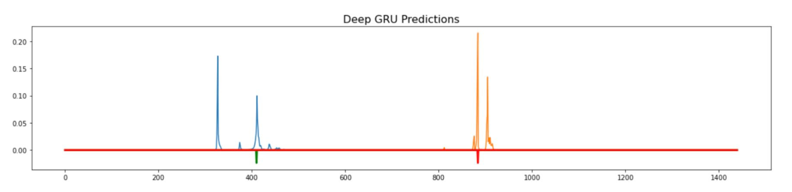

# Sleep State Detection

## Overview

This project focuses on sleep onset and wake-up detection using a wrist-worn accelerometer. A Deep-GRU (Gated Recurrent Unit) architecture with multihead attention is employed to train the data. The model is trained on data from approximately 280 patients, with each patient being recorded for around 23 nights. The RNN "block" uses bidirectional. The CNN "block" uses sums and products of multiple dilated convolutions. And the Transformer blocks uses self attention. 

## Data Visualization

## Model Architecture

## Dataset
#### train_series.parquet

# Results

